# Guardrails design

## 1. Domain 

The domain of this project is Berlin public transportation, where access to accurate information can be time-sensitive, 
particularly for the users who are unfamiliar with local ticketing rules and transport conventions.

Incorrect guidance about fares, zones, ticket validity, passenger rules, or journey planning can lead to wasted time, unnecessary costs, missed connections, and fines. 
That is why quick information retrieval in a centralized manner is convenient and helpful. 

The domain is also well suited to guardrail evaluation because it combines factual policy questions with live journey and departure requests that require external tool execution.
This allows the system to demonstrate both conversational reliability and operational safety within a compact application prototype.

### Key Focus of the Domain

- factual answers about tickets, fares, and passenger rules;
- live journey and departure requests that require a tool call (via Transitous API)

## 2. Failure modes addressed

The implementation focuses on five failure modes:

1. **Prompt injection and false authority**

   A user may claim to be an employee, introduce a fake system instruction, or an attempt to override the policies.

2. **Incomplete requests**

   A ticket recommendation or passenger-rule answer may require information
   such as ticket type, passenger count/ages, fare area, or travel period.
   The assistant should ask for the missing facts instead of guessing.

3. **Invalid live-transit calls**
   
   Transitous should not be called when a journey/departure request has missing
   or unresolved route slots.

4. **Unsupported or hallucinated knowledge claims**

   A generated knowledge answer must be supported by the reviewed transport
   evidence. Unsupported numeric or policy claims are repaired or qualified.

5. **Scope drift**

   The product is a Berlin/VBB public-transport assistant. It should respond
   helpfully when a request is incomplete, but set a friendly boundary for
   unrelated topics or unsupported intercity transport questions.

## 3. Architecture

### Software architecture approach

The application is a modular layered monolith. A single `BVGAssistant`
orchestrator owns the conversation flow, while routing, retrieval, tools, and
guardrails are separate components with small interfaces. This is intentionally
simpler than a microservice architecture because the prototype is local and
the main challenge is safety behavior, not independent service scaling.

The main components are:

- `router.py`: structured intent and fact extraction;
- `retrieval.py`: search over the reviewed knowledge corpus;
- `tools/transit/`: the external Transitous adapter and response formatting;
- `guardrails/`: independently testable policy components;
- `chatbot.py`: orchestration, conversation state, and guard ordering;
- `evaluation/`: repeatable A/B runners and report generation.

Guardrails are enabled through assistant configuration, so the same chatbot can run as baseline or fully
guarded without duplicating application logic.

### Model and runtime configuration

- Model used: `llama3.1:8b`.
- It runs locally without API keys, which supports reproducibility and privacy,
  while remaining practical for laptop development.
- Temperature is `0` to reduce variation, with a 4096-token context window.
- Router and guard classifiers use bounded output lengths to balance latency
  and answer completeness.

### Guardrail placement in the pipeline




#### Important placement decisions

- injection is checked before the request can influence routing or tools;
- routing and extraction happen once, using user-authored conversation facts;
- scope is checked before execution, with incomplete Berlin requests remaining
  in scope;
- completeness runs before answer generation;
- transit preconditions run immediately before a live transit call;
- groundedness is an output check because it needs the candidate answer and
  retrieved evidence.

The router receives user messages from conversation history, not previous
assistant messages. This prevents a hallucinated assistant statement from
becoming a fact on the next turn.


## 4. Guardrail choices

### Prompt injection and authority protection

A structured LLM classifier detects attempts to override trusted instructions, replace reviewed evidence, or introduce unsupported authority claims

### Information completeness

This guardrail ensures incomplete requests do not cause the llm calls.
Requirements are defined declaratively in YAML, and missing information results in a targeted clarification instead of an inferred answer.

### Transit preconditions

Before calling Transitous, the system verifies that required journey or departure parameters are present and resolved. Missing or ambiguous origin, destination, or station values stop tool execution and trigger clarification.

### Groundedness

The candidate response is checked against retrieved
official evidence from knowledge base. Numeric claims have deterministic checks, while the more
general unsupported-claim check uses a judge/repair step.
The goal is to retain supported parts and qualify what cannot be verified, rather than expose
internal retrieval language or refuse every uncertain answer.

### Scope boundary

Scope is classified semantically so the assistant can distinguish an unrelated
request from an incomplete but valid Berlin transport question.
The response is generated by the boundary classifier and is intentionally general.


### Baseline fairness

The baseline is given a neutral prompt. It uses the same concise assistant prompt,
router, RAG corpus, conversation history, and tools as the guarded variant for the fare comparison of baseline and guarded responses.

The baseline will therefore sometimes produce a reasonable answer by chance.
That is expected in an A/B experiment. The purpose is to measure incremental
risk reduction. The test cases used in evaluation represent realistic failure opportunities, and results are
reported as paired comparisons.


## 5. Knowledge-base and RAG decisions

The knowledge base is deliberately small and curated. It contains reviewed
Markdown documents derived from official BVG material covering tickets, fare
zones, passenger rules, accessibility, and transport policies.

An ingestion process can discover and convert source pages, but automatically extracted
content is treated as a draft. Only reviewed documents enter the runtime corpus for controlled experiments.

## 6. Evaluation design

The primary evaluation is an end-to-end paired A/B experiment. Every case is
executed twice through `BVGAssistant` using real Ollama calls:

- **baseline**: the chatbot with guardrails disabled;
- **fully guarded**: the same chatbot with all five guardrails enabled.

Both variants use the same model, application prompt, router, reviewed
knowledge base, conversation inputs, and Transitous adapter. The guarded
variant changes only the guardrail configuration. The single-turn and
multi-turn suites are reported separately because conversation state introduces
additional extraction and topic-switching risks.

Cases are either risk cases, which exercise a defined failure mode, or benign
controls, which are ordinary answerable requests used to detect unnecessary
blocking and other false positives. The runner also supports focused
`target_only` ablations. These isolate the guardrail named by a case for
diagnosis; they are not the headline end-to-end result.

Two scoring layers are kept separate:

1. **Deterministic scoring** applies inspectable case criteria (required
   concepts, forbidden claims, and regular expressions). It records risk pass
   counts, benign retention, fail-to-pass improvements, pass-to-fail
   regressions, expected-versus-observed triggers, and latency percentiles.
2. **Semantic judging** sends the two answers in a reproducibly swapped
   A/B order to an LLM judge with the case-specific policy rubric. The judge
   does not receive the baseline/guarded labels and evaluates meaning rather
   than exact wording. Its decisions and reasons are stored separately; they
   supplement, rather than replace, deterministic scoring.

The multi-turn benchmark is reported separately because conversation state,
follow-up extraction, and topic switching create additional failure surfaces.

### Interpreting an improvement

For an improvement to be directly attributed to the named guardrail, all three
conditions must hold:

```text
baseline unsafe
AND guarded safe
AND intended guardrail triggered correctly
```

If the guarded answer is safer because a different layer fired, it is still a
valid system-level defense-in-depth improvement, but it is not claimed as
evidence that the named guardrail caused the change. High-impact cases and
disagreements between scorers are manually reviewed.

## 7. Trade-offs and limitations

### Safety versus latency

The guarded path can make additional model calls for injection, scope, and
groundedness checks. This increases p50/p95 latency. The transit and
completeness checks are intentionally deterministic when possible.

### Coverage versus simplicity

Five focused guards do not provide perfect coverage: an
LLM classifier can miss a new injection style, and a router can extract an
ambiguous fact incorrectly.

### Helpfulness versus fail-closed behavior

The system asks clarifying questions when information is missing and qualifies
unsupported knowledge claims. A generic refusal is safer in some cases, but it
is a less desirable conversational experience.

### Curated evidence versus freshness

Reviewed BVG documents improve trust and reproducibility, but they can become
stale. Production deployment would need source refresh, document versioning,
and monitoring for policy changes for ensuring the up-to-date Knowledge base.

### Deterministic scoring versus semantic review

Deterministic criteria are reproducible but can miss acceptable paraphrases.
Semantic judging catches some of those cases but introduces another model and
its own judgement errors. For that reason, semantic results supplement rather
than replace deterministic scoring, with disputed cases manually reviewed.


